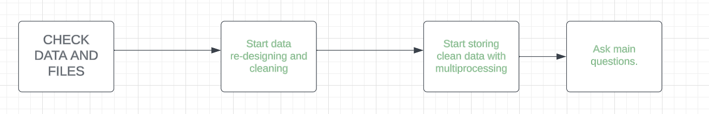

<h1 style="color: #6082B6">TODO</h1>

<h3>
    
    Note: Given Todo list contains "ErrorHandling" decorator which means
          that each of subtask takes into account perfectionism and 
          errorhandling!

    @ErrorHandling
    1. Check if given file and data exists  
    2. Start data re-designing and cleaning
    3. Build up durability system (disaster recovery)
    4. Start storing clean data with multiprocessing  
    5. Ask main questions:
        {
            1. List top 10 most common name on the social net?
               How many people belong to that name?
            2. List the five people
               with the most posts and reactions combined.
            3. plot the friendships and friends’ network
               (using network module)
        }
    
    

</h3>

<h1 style="color: #6082B6">Directory Management:</h1>

<h3>

    1. Utils { 1.1 Decorators - stores decorators
                                (checking data & file,
                                non data connected error handling)
               1.2 Process - stores processing tools,
                             data cleaning,
                             storing,
                             data connected error handling,
                             data selecting}
               1.3 RawData - stores given raw data (needs re-design & cleaning)
               1.4 Cleaning - stores processed data, after re-designing and cleaning the data schema (Final data)

    2. main.py (needs no explanation)

</h3>

<h1 style="color: #6082B6">
Workflow Plan

</h1>